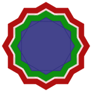

---
layout: default
title: "Geometria da VIDA"
reading_time: 3
semantic_order: 1
tags:
  - Wingene
  - método VIDA
  - Matemática
--- 

### [Geometria](./)

## Geometria da VIDA

### O logotipo padrão

Esse é o logotipo padrão da Wingene:

Ele representa os quatro eixos do acróstico [VIDA](/wingene/o-metodo-vida-a-wingene-em-pratica.html), sendo formado pelo dodecagrama e suas estrelas poligonais, com tamanho aumentado. Cada estrela é preenchida com uma cor e sobreposta em sequência conforme abaixo:

1. {12/5} - Vermelho: os valores éticos. O dodecagrama.

1. {12/3} - Amarelo: as imperfeições. Estrela composta por quatro triângulos.

1. {12/4} - Verde: as decisões. Estrela com três quadrados.

1. {12/2} - Azul com ligeira opacidade: a Atenção. Estrela de dois hexágonos.

O vermelho representa a herança biológica e cultural. O dodecagrama base {12/5} que gera todas as demais estrelas. Um sinal indelével para a conduta ética definida pelos valores da nossa herança ancestral.

O amarelo, as imperfeições, vêm logo em seguida como uma estrela {12/4}. Incrustado no vermelho, nos recorda não somente as nossas falhas, como também as inconsistências presentes na herança.

O verde é um chamado à ação, a força de decidir enfrentar as imperfeições enquadradas no radar pela atenção. Os brotos dos valores que lutam contra as imperfeições por atitudes reiteradas contra as mesmas.

O azul, a atenção, se estende como hexágonos num plano, cobrindo todas as áreas da vida, permitindo detectar o amarelo que se esconde na presunção individual. Sua opacidade é um lembrete para a fugacidade da presença.

### A harmonia matemática

No universo dos polígonos estrelados, o {12/5} é o "limite harmônico". Ele é o último a manter a simetria perfeita antes que a complexidade se torne caótica. Para a Wingene, isso significa que a base ancestral é a estrutura mais complexa possível que ainda permite a ordem total interna.

As figuras que compõem as estrelas internas, triângulos, quadrados e hexágonos, são as únicas figuras geométricas que, idênticas, podem ser replicadas para formar um plano infinito.

Os triângulos e quadrados geram os únicos três politopos regulares possíveis em qualquer dimensão (Simplex, Hipercubo e Ortoplexo). As imperfeições (triângulos) e as decisões (quadrados) são blocos de construção da realidade, permitindo "dar volume" à existência, saindo do plano abstrato para o concreto da vida na quarta dimensão.

Os hexágonos azuis representam a atenção que situa o espírito no horizonte material. A presença consciente, que enxerga os avanços e fracassos, e permite a evolução.

### Imagem simplificada

Para um ícone em tamanho reduzido, esse logotipo não é adequado. Então, foi criada uma versão simplificada utilizando estrelas poligonais {12/2}, quatro estrelas de dois hexágonos:

Na simplificação, o amarelo foi extirpado da imagem, sendo substituído por um branco com uma pequena opacidade. Uma simplificação adequada para a sua finalidade. Apesar disso, visualizações à distância ou em tamanhos pequenos trazem a ilusão subliminar do mesmo entre o verde e o vermelho. Um alerta para a dificuldade pessoal em reconhecer as imperfeições. Muitas vezes, tão nítidas para quem observa de fora.

Este é o ícone reduzido, onde é possível ver o halo amarelo subliminar: 

Detalhes técnicos da geração das imagens e mais observações geométricas podem ser vistos na página que contém o código: [Wingene: os logotipos](/wingene-logo.html).

Uma análise matemática do dodecagrama pode ser lida no artigo: [Teorema do dodecagrama regular](./Teorema_dodecagrama_regular.pdf)