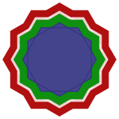

---
layout: default
title: "Geometria e o método VIDA"
reading_time: 3
semantic_order: 1
tags:
  - Wingene
  - método VIDA
  - Matemática
--- 

### [Geometria](./)

## Geometria e o método VIDA

### O logotipo padrão

Esse é o logotipo padrão da Wingene:

Ele representa os quatro eixos do acróstico [VIDA](/wingene/o-metodo-vida-a-wingene-em-pratica.html), sendo formado pelo dodecagrama e seus anéis poligonais, com tamanho aumentado de acordo com as frequências de um acorde de dó maior (CEGc). Cada estrela é preenchida com uma cor e sobreposta em sequência conforme abaixo:

1. {12/5} - Vermelho: os valores éticos. O dodecagrama.

1. {12/4} - Amarelo: as imperfeições. Estrela composta por quatro triângulos.

1. {12/3} - Verde: as decisões. Estrela composta por três quadrados.

1. {12/2} - Azul com ligeira opacidade: a atenção — o espírito. Estrela composta por dois hexágonos.

1. {12/1} - Transparente, dodecágono - o polígono regular de doze lados.

O vermelho representa a herança biológica e cultural. O dodecagrama base {12/5} que gera todas as demais estrelas. Um sinal indelével para a conduta ética definida pelos valores da nossa herança ancestral.

O amarelo, as imperfeições, vêm logo em seguida como uma estrela {12/4}. Incrustado no vermelho, nos recorda não somente as nossas falhas, como também as inconsistências presentes na herança.

O verde é um chamado à ação, a força de decidir enfrentar as imperfeições enquadradas pela atenção. Os brotos dos valores que lutam contra as imperfeições por atitudes reiteradas contra as mesmas.

O azul, a atenção, se estende como hexágonos num plano, cobrindo todas as áreas da vida, permitindo detectar o amarelo que pode esconder-se na presunção individual. Sua opacidade é um lembrete para a fugacidade da presença.

A transparência do dodecágono representa a herança espiritual, o legado que deixará cada um, que não é somente positivo, mas marcado pelas imperfeições — a semente de novos dodecagramas.

### Imagem simplificada

Para um ícone em tamanho reduzido, esse logotipo não é adequado. Então, foi criada uma versão simplificada utilizando estrelas poligonais {12/2}, quatro estrelas de dois hexágonos:

Na simplificação, o amarelo foi extirpado da imagem, sendo substituído por uma estrela branca com uma pequena opacidade. Apesar disso, a visualização à distância ou em tamanhos pequenos traz a ilusão subliminar do amarelo entre o verde e o vermelho. Um alerta para a dificuldade pessoal em reconhecer as imperfeições. Muitas vezes, tão nítidas para quem observa de fora.

Este é o ícone reduzido, onde é possível ver o halo amarelo subliminar: 

### A harmonia matemática

As figuras que compõem as estrelas internas, triângulos, quadrados e hexágonos, são os únicos polígonos regulares convexos que, idênticos, podem tesselar um plano infinito. O dodecágono invisível, no logotipo, participa de tesselações semi-regulares com a ajuda de combinações de triângulos, quadrados e hexágonos — em especial consideramos a combinação 3.4.6.12, que inclui todos os polígonos regulares do logotipo. Uma lembrança de que o legado não é só espiritual, mas construído pelas decisões e realçado pelas imperfeições.

Os triângulos e quadrados aparecem como faces das três famílias infinitas de politopos regulares convexos que existem em qualquer dimensão (simplex, hipercubo e ortoplexo). As imperfeições (triângulos) e as decisões (quadrados) são blocos de construção da realidade, permitindo "dar volume" à existência, saindo do plano abstrato para o concreto da vida na quarta dimensão. Os hexágonos azuis representam a atenção que situa o espírito no plano material. A presença consciente, que enxerga os avanços e fracassos, e permite a evolução. O hexágono é o primeiro polígono regular que não aparece como face de politopos regulares convexos em qualquer dimensão.

O dodecagrama {12/5} é o “[limite harmônico](./the-dodecagram-poligonal-theorem.html)”: o polígono estrelado regular com maior número de vértices capaz de gerar, em seus anéis internos, apenas polígonos regulares — os mesmos triângulos, quadrados e hexágonos que formam o logotipo. Além dele, a ordem interna se desfaz.

Para a Wingene, isso significa que a herança ancestral é a estrutura mais complexa possível que ainda sustenta harmonia. O caos não começa do nada — começa exatamente onde o {12/5} termina.

Detalhes técnicos da geração das imagens podem ser vistos na página que contém o código: [Wingene: os logotipos](/wingene-logo.html).